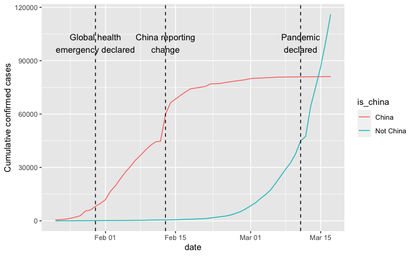
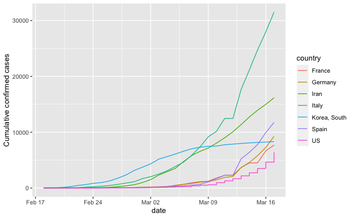

# Covid-19-Visualisation

## Introduction 

Coronavirus disease (COVID-19) is an infectious disease caused by the SARS-CoV-2 virus. Covid-19 is a cause of the current pandemic, but it wasn't like this at the start. This project visualises COVID-19 data from the first several weeks of the outbreak to see at what poin it became a pandemic. (Project done using DataCamp)

### COVID-19
Coronavirus disease 2019 (COVID-19) is a contagious disease caused by severe acute respiratory syndrome coronavirus 2 (SARS-CoV-2). The first known case was identified in Wuhan, China, in December 2019. The disease has since spread worldwide, leading to an ongoing pandemic.The disease has since spread worldwide, leading to an ongoing pandemic.


## Libraries used
- **readr** - to read csv files.
- **dplyr** -  primarily a set of functions designed to enable dataframe manipulation in an intuitive, user-friendly way.
- **ggplot2** - open-source data visualization package for the statistical programming.

## Load files 
```
confirmed_cases_worldwide <- read_csv("/Users/sofyarabinovich/Desktop/Programming/R-professional-certificate/Visualizing-COVID-19/datasets/confirmed_cases_worldwide.csv")
confirmed_cases_china_vs_world <- read_csv("/Users/sofyarabinovich/Desktop/Programming/R-professional-certificate/Visualizing-COVID-19/datasets/confirmed_cases_china_vs_world.csv")
confirmed_cases_by_country <- read_csv("/Users/sofyarabinovich/Desktop/Programming/R-professional-certificate/Visualizing-COVID-19/datasets/confirmed_cases_by_country.csv")
confirmed_cases_top7_outside_china <- read_csv("/Users/sofyarabinovich/Desktop/Programming/R-professional-certificate/Visualizing-COVID-19/datasets/confirmed_cases_top7_outside_china.csv")
```
# Start of the outbreak
Early on in the outbreak, the COVID-19 cases were primarily centered in China. During the early stages of the outbreak, the number of cases doubled approximately every seven and a half days. In early and mid-January 2020, the virus spread to other Chinese provinces, helped by the Chinese New Year migration and Wuhan being a transport hub and major rail interchange. On 20 January, China reported nearly 140 new cases in one day, including two people in Beijing and one in Shenzhen. Later official data shows 6,174 people had already developed symptoms by then,and more may have been infected.


Italy had its first confirmed cases on 31 January 2020, two tourists from China. Italy overtook China as the country with the most deaths on 19 March 2020. By 26 March the United States had overtaken China and Italy with the highest number of confirmed cases in the world. Research on coronavirus genomes indicates the majority of COVID-19 cases in New York came from European travellers, rather than directly from China or any other Asian country. Retesting of prior samples found a person in France who had the virus on 27 December 2019, and a person in the United States who died from the disease on 6 February 2020.



### Hardest Hit 
Even though the outbreak was first identified in China, there is only one country from East Asia (South Korea) in the above table. Four of the listed countries (France, Germany, Italy, and Spain) are in Europe and share borders.


